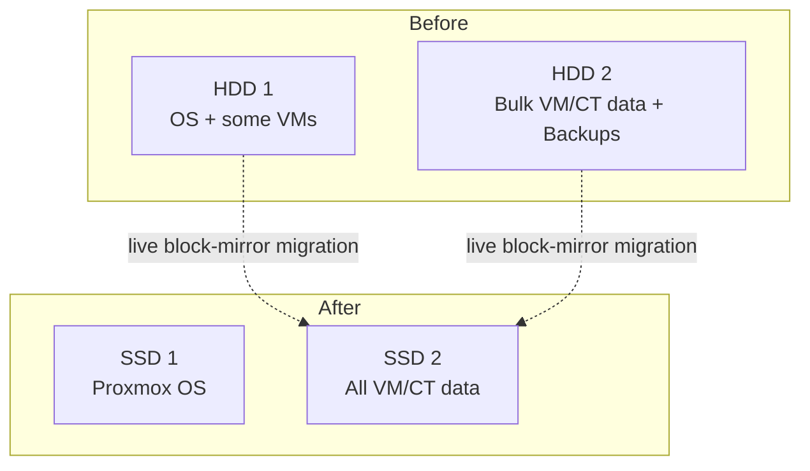
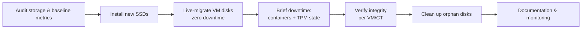
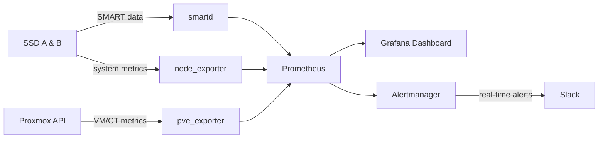

---

## TL;DR

| | |
|---|---|
| **Problem** | Production server suffering from 78% I/O Delay, Load Average >35, SWAP nearly full (99.97%) |
| **Constraint** | Zero downtime required — 9 VMs/CTs actively serving production (database, CI/CD, backup server, etc.) |
| **Solution** | Live block-mirror migration (`qm disk move`) from HDD to SSD, combined with brief planned downtime for LXC containers (platform limitation) |
| **Result** | I/O Delay dropped to 0.17%, Load Average down to ~1.1, SWAP usage down to 0.52% |
| **Data loss** | Zero — all data verified intact post-migration |
| **Final state** | Fully consolidated onto a single SSD; second SSD repurposed for multi-server expansion |

---

## Table of Contents

- [Background](#background)
- [Constraints & Initial Challenges](#constraints--initial-challenges)
- [Architecture Before & After](#architecture-before--after)
- [Technical Approach](#technical-approach)
- [Execution](#execution)
- [Incidents & Resolutions](#incidents--resolutions)
- [Results](#results)
- [Phase 2: Observability & Proactive Monitoring](#phase-2-observability--proactive-monitoring)
- [Phase 3: Single-SSD Consolidation & Repurposing](#phase-3-single-ssd-consolidation--repurposing)
- [Lessons Learned](#lessons-learned)
- [Tech Stack](#tech-stack)
- [Next Steps](#next-steps)

---

## Background

The production server (Dell PowerEdge T440, Proxmox VE, 16-core Xeon Silver 4110) ran 9 production workloads — a mix of Windows Server VMs (databases & business applications) and Linux containers (CI/CD engine, reverse proxy, backup server, DNS remap) — on top of 2x large-capacity HDDs.

Observed symptoms:
- Applications felt sluggish, especially during high I/O periods (backups running, CI/CD builds)
- Proxmox dashboard showed **78.25% I/O Delay** and **35.79 Load Average** — far above normal for an actual CPU usage of only 17.98%
- **99.97% SWAP usage** — indicating chronic memory pressure

Initial diagnosis: a combination of **HDD as the I/O bottleneck** and **insufficient RAM**, causing the system to constantly wait on disk and swap to the same slow disk — a self-reinforcing degradation loop.

## Constraints & Initial Challenges

1. **Zero-downtime was mandatory** — all VMs/CTs were actively serving production, including databases and a scheduled backup system (07:00, 15:00, 23:00)
2. **No long maintenance window available** at the start of the project
3. **New SSD hardware** had to be installed and integrated without powering down the production server

## Architecture Before & After



**Storage layout at this stage:**

| Storage | Purpose | Contents |
|---|---|---|
| SSD A (`local-lvm`) | Proxmox host OS | Root filesystem, swap |
| SSD B (`ssd-storage`, LVM-Thin) | VM/Container data | 3x Windows VMs (100GB each), 6x LXC Containers (8GB–1TB) |

> **Strategy note:** installing the OS onto SSD A and cloning VMs/CTs onto SSD B were run **in parallel**, not sequentially — saving total migration time since the two processes had no dependency on each other.

## Technical Approach

**Live block-mirror** (`qm disk move` for VMs, `pct move-volume` for containers) was chosen over a conventional backup-reinstall-restore approach, because:

| Approach | Downtime | Complexity | Risk |
|---|---|---|---|
| Backup → reinstall → restore | High (hours) | Low | Low, but doesn't meet the constraint |
| **Live block-mirror** ✅ | Near-zero (for VMs) | High | Requires careful edge-case handling |
| Storage replication (DRBD/ZFS send) | Zero | Very high | Overkill for a one-time migration |

**How live block-mirror works:**
1. A new empty disk is created on the destination storage
2. Existing data is fully copied to the new disk
3. During the copy, every new write from the VM is mirrored to BOTH disks (old & new) synchronously
4. Once fully synced, an atomic cutover occurs — the VM is switched to the new disk without a restart
5. The old disk becomes static (no longer receives updates)

> **Important caveat:** this approach doesn't apply to every component. LXC containers and TPM state (virtual TPM for Windows) **do not support live-move** in Proxmox — both require a brief stop. This was handled by scheduling separate brief-downtime windows for those components, decoupled from the components that could be live-migrated.

## Execution



**Summary of stages:**
1. Initial audit — mapping every VM/CT, actual vs. allocated disk size, checking latest backups
2. **Two processes run in parallel for efficiency:** fresh Proxmox OS installation onto SSD A, alongside initializing SSD B as the LVM-Thin target storage for VM/CT cloning
3. Live migration of the main disk for all Windows VMs (3 VMs, @100GB) onto SSD B — zero downtime
4. Migration of LXC containers (6 CTs) via brief stop-move-start — downtime measured in minutes
5. Migration of TPM state for Secure-Boot VMs (platform limitation, requires a brief VM stop)
6. Functional verification — logging into each VM/CT, checking applications & data
7. Cleanup of orphaned/duplicate disks left over from migration attempts that had failed
8. Before-after documentation for reporting

## Incidents & Resolutions

This section documents the real issues encountered during execution — arguably the most valuable part to learn from, since migrations rarely go 100% smoothly.

### 1. Interrupted migration leaves an orphan disk

**Symptom:** a `qm disk move` process was interrupted (SSH connection dropped mid-transfer of a 100GB disk), leaving a partial disk on the destination storage that wasn't automatically cleaned up.

**Diagnosis:**
```bash
pvesm list ssd-storage   # a duplicate disk with the same VMID appears
qm config <vmid>         # the VM config still points to the old disk — migration never cut over
```

**Resolution:** removed the partial disk with `pvesm free`, then re-ran the migration inside a `tmux` session to make it resilient to SSH disconnects.

### 2. Logical volume "in use" when removing the orphan disk

**Symptom:** `pvesm free` failed with `Logical volume in use`, even though the VM config no longer referenced that disk.

**Diagnosis:**
```bash
fuser -v /dev/<vg>/<lv-name>
```
Found that the `kvm` process belonging to that same VM was still holding a file descriptor to the old disk — QEMU doesn't always release the old disk reference immediately after cutover, especially following a previously failed migration attempt.

**Resolution:** deferred until the VM was naturally restarted (scheduled alongside the hardware maintenance window); afterward the new QEMU process no longer held the old disk open, and removal succeeded.

### 3. Containers cannot be live-migrated

**Symptom:** `pct move-volume` on a running container failed with `cannot move volumes of a running container`.

**Root cause:** this is an architectural limitation of LXC in Proxmox — unlike VMs (whose block devices are abstracted through QEMU and can be mirrored), a container's rootfs is bound directly to the host kernel. Live storage migration for containers simply isn't supported.

**Resolution:** scheduled as brief planned downtime per container (stop → move → start), sequenced to avoid saturating the same I/O bandwidth simultaneously.

### 4. TPM state cannot be moved while the VM is running

**Symptom:** `cannot move TPM state while VM is running`.

**Root cause:** Proxmox's vTPM is tied to the lifecycle of a separate TPM emulator process (`swtpm`), running independently from a regular disk device — it does not support live block-mirroring.

**Resolution:** same as containers — moved during a brief VM stop, scheduled together with the hardware maintenance window (RAM upgrade & CPU repaste) to avoid repeated downtime at separate times.

### 5. Corrupted VM configuration after migration (disk attached twice)

**Symptom:** after a series of migration attempts (including some that had failed), one VM ended up with the same disk attached twice under different slots (`ide0` and `scsi0` pointing to the identical volume), plus a TPM state entry using a path format invalid for the storage type in use (mixing directory-style paths with LVM-Thin conventions).

**Diagnosis:** a full audit of `qm config` for every VM, cross-referenced against `pvesm list` to map which disks were genuinely valid versus broken references.

**Resolution:**
```bash
qm set <vmid> --delete <duplicate-slot>
qm set <vmid> --tpmstate0 <storage>:<correct-volume>,size=4M,version=v2.0
```
Verified through Windows Disk Management inside the VM — the old duplicated disk automatically appeared as "Offline" in Windows because its disk signature matched the active disk, confirming it was safe to remove.

## Results

| Metric | Before | After | Change |
|---|---|---|---|
| **I/O Delay** | 78.25% | 0.17% | ⬇️ -99.8% |
| **Load Average** | 35.79 / 33.83 / 26.42 | 1.07 / 1.16 / 1.28 | ⬇️ ~97% |
| **SWAP Usage** | 99.97% (19.99/20 GiB) | 0.52% (42.78 MiB/8 GiB) | ⬇️ Nearly eliminated |
| **Total RAM** | 30.85 GiB | 62.30 GiB | ⬆️ 2x (upgraded concurrently) |
| **CPU Usage** | 17.98% | 22.02% | Stable (a reasonable increase as the system became more responsive) |
| **Data loss** | — | 0 | ✅ |
| **Permanent VM/CT downtime** | — | 0 | ✅ |

<table>
<tr>
<td width="50%">

**Before Migration**


</td>
<td width="50%">

**After Migration**


</td>
</tr>
</table>

**Interpretation:** the very high Load Average (35.79) alongside low CPU usage (17.98%) is a classic sign of a system stalled waiting on I/O, not one lacking processing power. After migration, both metrics realigned — CPU usage rose slightly (the system was more responsive in processing its queue), while Load Average dropped sharply since processes were no longer waiting on disk.

## Lessons Learned

- **Always run long-running disk operations inside `tmux`/`screen`** — an SSH disconnect mid live-migration leaves a partial state that's painful to clean up.
- **QEMU doesn't always release the old disk's file descriptor immediately** after cutover, especially following a previously failed attempt — restarting the VM process is the safest way to release a lingering lock, rather than force-killing a production VM's process.
- **Live-migrate is not permanent mirroring** — once cutover completes, the old disk freezes and stops receiving updates. It's important the team understands this so the old disk isn't mistaken for a real-time backup.
- **Separate live-migratable components from non-live-migratable ones** (containers, TPM state) early in planning, and batch the ones requiring downtime into a single maintenance window to minimize repeated disruption.
- **A thorough post-migration audit is mandatory, not optional** — cross-check every VM/CT's config against what physically exists in storage to catch broken/duplicate references before calling the job done.

## Tech Stack

- **Hypervisor:** Proxmox VE 9.x
- **Storage:** LVM-Thin on SSD (previously on HDD)
- **Guest OS:** Windows Server/11 (VMs), Debian/Ubuntu (LXC)
- **Migration tools:** `qm`, `pct`, `pvesm`, `lvm2`, `tmux`
- **Monitoring:** Prometheus, Grafana, Alertmanager, `smartmontools` (smartd)
- **Notifications:** Slack

## Phase 2: Observability & Proactive Monitoring

After the storage migration was complete, a 24/7 monitoring layer was built to catch similar incidents (impending disk failure, I/O bottlenecks) earlier — run in a dedicated CT (`SERVER-MONITOR`) to stay independent of production workloads.



| Component | Status |
|---|---|
| Prometheus + Grafana + Alertmanager | ✅ Deployed on a dedicated CT (`SERVER-MONITOR`) |
| SMART monitoring (`smartd`) on both SSDs | ✅ Active with alerting |
| Notifications | ✅ Integrated with Slack |

With this in place, potential disk failure (increasing wear level, growing bad sector count) or performance regressions (I/O Delay creeping back up) can be detected and reported to the team in real time — rather than only being noticed after users feel the symptoms, as happened with the original incident that triggered this migration project.

## Phase 3: Single-SSD Consolidation & Repurposing

After the RAM/CPU maintenance and the monitoring layer had proven stable, the entire contents of SSD B (VM/CT data) were cloned back onto SSD A using the same approach as the initial migration (live block-mirror for VMs, brief downtime for containers) — this time in reverse, consolidating everything onto a single disk. The only downtime required was a brief server shutdown for the final cutover.

**Outcome:**
- SSD A now holds everything: the Proxmox OS plus all VM/CT data
- Orphaned/duplicate disks left over from the cloning process were fully cleaned up
- SSD B was removed from the server and prepared for repurposing as a storage node/load balancer at a separate server location — the first step toward a multi-server architecture

The "clone then remove" approach was chosen because the pattern had already proven safe during the Phase 1 migration — reducing risk compared to trying an untested new approach.

## Next Steps

- [x] ~~Consolidate onto a single SSD~~ — done, see [Phase 3](#phase-3-single-ssd-consolidation--repurposing)
- [x] ~~Repurpose SSD B as a storage node/load balancer at a separate server~~ — SSD removed and ready for the target location
- [x] ~~Implement 24/7 monitoring (SMART health checks, Prometheus + Grafana + Alertmanager)~~ — done, see [Phase 2](#phase-2-observability--proactive-monitoring)
- [x] ~~Final cleanup of remaining orphan disks~~ — completed alongside the Phase 3 consolidation
- [ ] Tune alert thresholds (I/O Delay, SWAP, SSD temperature) based on a few weeks of operational baseline
- [ ] Set up the load balancer on SSD B at the new server location (follow-up project)

> Redundancy plans (ZFS Mirror / hardware RAID on the MegaRAID controller) were re-evaluated given that the infrastructure direction is moving toward a multi-server topology rather than a dual-disk setup on a single server.

---

<sub>Note: application names, IP addresses, credentials, and client-identifying details have been removed/anonymized from this case study to preserve production data confidentiality.</sub>
