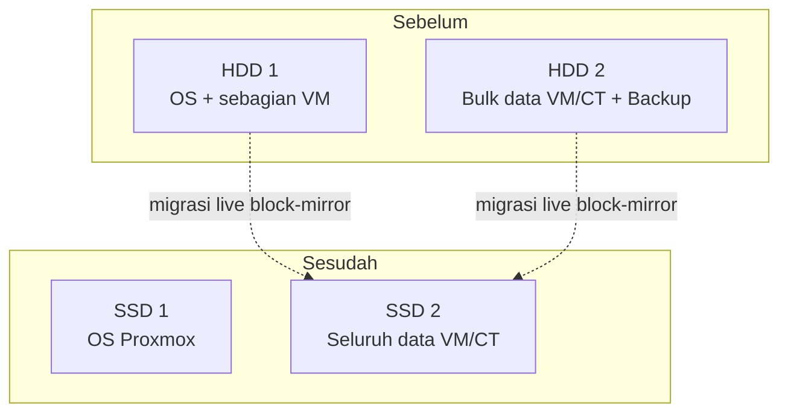
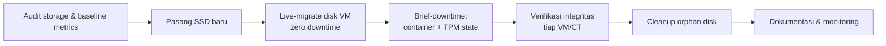
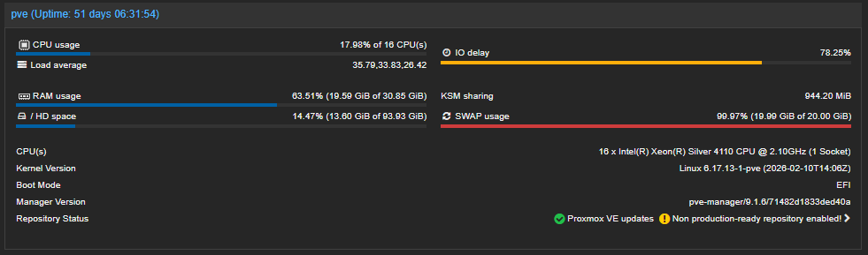
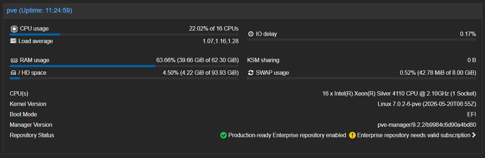

---

## TL;DR

| | |
| **Masalah** | Server produksi mengalami I/O Delay 78%, Load Average >35, SWAP hampir penuh (99.97%) |
| **Constraint** | Tidak boleh downtime — 9 VM/CT sedang aktif melayani produksi (database, CI/CD, backup server, dll) |
| **Solusi** | Live block-mirror migration (`qm disk move`) dari HDD ke SSD, dikombinasikan dengan brief-downtime untuk LXC container (limitasi platform) |
| **Hasil** | I/O Delay turun ke 0.17%, Load Average turun ke ~1.1, SWAP usage turun ke 0.52% |
| **Data loss** | Nol — seluruh data tervalidasi utuh pasca migrasi |
| **Status akhir** | Konsolidasi tuntas ke 1 SSD; SSD kedua direpurpose untuk ekspansi multi-server |

---

## Daftar Isi

- [Latar Belakang](#latar-belakang)
- [Constraint & Tantangan Awal](#constraint--tantangan-awal)
- [Arsitektur Sebelum & Sesudah](#arsitektur-sebelum--sesudah)
- [Pendekatan Teknis](#pendekatan-teknis)
- [Eksekusi](#eksekusi)
- [Insiden & Cara Penyelesaian](#insiden--cara-penyelesaian)
- [Hasil](#hasil)
- [Fase 2: Observability & Proactive Monitoring](#fase-2-observability--proactive-monitoring)
- [Fase 3: Konsolidasi ke Single-SSD & Repurposing](#fase-3-konsolidasi-ke-single-ssd--repurposing)
- [Lessons Learned](#lessons-learned)
- [Tech Stack](#tech-stack)
- [Tindak Lanjut](#tindak-lanjut)

---

## Latar Belakang

Server produksi (Dell PowerEdge T440, Proxmox VE, 16 core Xeon Silver 4110) menjalankan 9 workload produksi — kombinasi Windows Server (database & aplikasi bisnis) dan Linux container (CI/CD engine, reverse proxy, backup server, DNS remap) — di atas 2x HDD berkapasitas besar.

Gejala yang muncul:
- Aplikasi terasa lambat, terutama saat beban I/O tinggi (backup berjalan, build CI/CD)
- Dashboard Proxmox menunjukkan **I/O Delay 78.25%** dan **Load Average 35.79** — jauh di atas normal untuk CPU usage yang sebenarnya hanya 17.98%
- **SWAP usage 99.97%** — indikasi tekanan memori kronis

Diagnosis awal: kombinasi **HDD sebagai bottleneck I/O** dan **RAM tidak mencukupi**, menyebabkan sistem terus-menerus menunggu disk dan swapping ke disk yang sama-sama lambat — siklus yang saling memperburuk.

## Constraint & Tantangan Awal

1. **Zero-downtime wajib** — seluruh VM/CT sedang melayani produksi aktif, termasuk database dan sistem backup terjadwal (07:00, 15:00, 23:00)
2. **Tidak ada jendela maintenance panjang** di awal proyek
3. **Hardware SSD baru** perlu dipasang dan diintegrasikan tanpa mematikan server produksi

## Arsitektur Sebelum & Sesudah



**Storage layout akhir (fase ini):**

| Storage | Fungsi | Isi |
|---|---|---|
| SSD A (`local-lvm`) | OS Proxmox host | Root filesystem, swap |
| SSD B (`ssd-storage`, LVM-Thin) | Data VM/Container | 3x Windows VM (100GB masing-masing), 6x LXC Container (8GB–1TB) |

> **Catatan strategi:** instalasi OS ke SSD A dan proses cloning VM/CT ke SSD B dilakukan **paralel** (bersamaan), bukan berurutan — menghemat waktu total migrasi karena kedua proses tidak saling bergantung.

## Pendekatan Teknis

Dipilih **live block-mirror** (`qm disk move` untuk VM, `pct move-volume` untuk container) alih-alih pendekatan backup-reinstall-restore konvensional, karena:

| Pendekatan | Downtime | Kompleksitas | Risiko |
|---|---|---|---|
| Backup → reinstall → restore | Tinggi (jam) | Rendah | Rendah, tapi tidak memenuhi constraint |
| **Live block-mirror** ✅ | Mendekati nol (untuk VM) | Tinggi | Perlu penanganan edge case dengan hati-hati |
| Storage replication (DRBD/ZFS send) | Nol | Sangat tinggi | Overkill untuk migrasi satu kali |

**Cara kerja live block-mirror:**
1. Disk baru dibuat kosong di storage tujuan
2. Data lama disalin penuh ke disk baru
3. Selama proses penyalinan, setiap write baru dari VM di-mirror ke KEDUA disk (lama & baru) secara sinkron
4. Setelah sinkron penuh, terjadi cutover atomik — VM otomatis dialihkan ke disk baru tanpa restart
5. Disk lama menjadi statis (tidak lagi menerima update)

> **Catatan penting:** pendekatan ini tidak berlaku untuk seluruh komponen. Container LXC dan TPM state (virtual TPM untuk Windows) **tidak mendukung live-move** di Proxmox — keduanya memerlukan proses berhenti sejenak. Ini ditangani dengan menjadwalkan brief-downtime terpisah untuk komponen tersebut, dipisah dari komponen yang bisa live-migrate.

## Eksekusi



**Ringkasan tahapan:**
1. Audit kondisi awal — pemetaan seluruh VM/CT, ukuran disk aktual vs alokasi, cek backup terbaru
2. **Dua proses dijalankan paralel untuk efisiensi waktu:** instalasi fresh Proxmox OS ke SSD A, bersamaan dengan inisialisasi SSD B sebagai target LVM-Thin storage untuk cloning VM/CT
3. Migrasi live disk utama untuk seluruh VM Windows (3 VM, @100GB) ke SSD B — zero downtime
4. Migrasi container LXC (6 CT) via brief stop-move-start — downtime dalam hitungan menit
5. Migrasi TPM state untuk VM ber-Secure Boot (limitasi platform, butuh VM stop sesaat)
6. Verifikasi fungsional — login ke tiap VM/CT, cek aplikasi & data
7. Cleanup disk orphan/duplikat hasil percobaan migrasi yang sempat gagal
8. Dokumentasi before-after untuk pelaporan

## Insiden & Cara Penyelesaian

Bagian ini mendokumentasikan masalah nyata yang muncul selama eksekusi — bagian yang menurut saya paling bernilai untuk dipelajari, karena migrasi jarang berjalan 100% mulus.

### 1. Interrupted migration meninggalkan orphan disk

**Gejala:** proses `qm disk move` terputus (koneksi SSH terputus di tengah transfer 100GB), meninggalkan disk parsial di storage tujuan yang tidak terhapus otomatis.

**Diagnosis:**
```bash
pvesm list ssd-storage   # tampak disk duplikat dengan VMID sama
qm config <vmid>         # config VM tetap menunjuk ke disk lama — migrasi belum cutover
```

**Solusi:** hapus disk parsial dengan `pvesm free`, ulangi migrasi di dalam sesi `tmux` agar tahan terhadap disconnect SSH.

### 2. Logical volume "in use" saat menghapus orphan disk

**Gejala:** `pvesm free` gagal dengan pesan `Logical volume in use`, padahal config VM sudah tidak menunjuk ke disk tersebut.

**Diagnosis:**
```bash
fuser -v /dev/<vg>/<lv-name>
```
Ditemukan proses `kvm` milik VM yang sama masih memegang file descriptor ke disk lama — QEMU tidak selalu melepas referensi disk lama segera setelah cutover, terutama pasca migrasi yang sempat gagal sebelumnya.

**Solusi:** ditunda hingga VM tersebut direstart secara alami (dijadwalkan bersamaan dengan maintenance window hardware), setelah itu proses QEMU baru tidak lagi membuka disk lama dan penghapusan berhasil.

### 3. Container tidak bisa live-migrate

**Gejala:** `pct move-volume` pada container yang sedang berjalan gagal dengan `cannot move volumes of a running container`.

**Root cause:** ini adalah limitasi arsitektural LXC di Proxmox — berbeda dari VM (yang block device-nya diabstraksi lewat QEMU dan bisa di-mirror), rootfs container terikat langsung ke kernel host. Live-migrate storage untuk container memang tidak didukung.

**Solusi:** dijadwalkan sebagai brief planned-downtime per container (stop → move → start), diurutkan agar tidak membebani bandwidth I/O yang sama secara bersamaan.

### 4. TPM state tidak bisa dipindah saat VM aktif

**Gejala:** `cannot move TPM state while VM is running`.

**Root cause:** vTPM Proxmox terikat pada siklus hidup proses TPM emulator (`swtpm`) yang berjalan terpisah dari device disk biasa — tidak mendukung live block-mirror.

**Solusi:** sama seperti container, dipindahkan saat VM stop sejenak, dijadwalkan bersamaan dengan maintenance window hardware (upgrade RAM & repaste CPU) agar downtime tidak berulang di waktu terpisah.

### 5. Konfigurasi VM corrupt pasca migrasi (disk ter-attach ganda)

**Gejala:** setelah serangkaian percobaan migrasi (termasuk yang sempat gagal), satu VM memiliki disk yang sama ter-attach dua kali dengan slot berbeda (`ide0` dan `scsi0` menunjuk volume identik), plus TPM state dengan format path yang tidak valid untuk tipe storage yang dipakai (mencampur konvensi path direktori dengan LVM-Thin).

**Diagnosis:** audit menyeluruh `qm config` untuk setiap VM, dibandingkan dengan `pvesm list` untuk memetakan disk yang benar-benar valid vs referensi yang rusak.

**Solusi:**
```bash
qm set <vmid> --delete <slot-duplikat>
qm set <vmid> --tpmstate0 <storage>:<volume-benar>,size=4M,version=v2.0
```
Diverifikasi lewat Windows Disk Management di dalam VM — disk lama yang ter-duplikat otomatis muncul sebagai "Offline" oleh Windows karena disk signature identik dengan disk aktif, mengonfirmasi aman untuk dilepas.

## Hasil

| Metrik | Sebelum | Sesudah | Perubahan |
|---|---|---|---|
| **I/O Delay** | 78.25% | 0.17% | ⬇️ -99.8% |
| **Load Average** | 35.79 / 33.83 / 26.42 | 1.07 / 1.16 / 1.28 | ⬇️ ~97% |
| **SWAP Usage** | 99.97% (19.99/20 GiB) | 0.52% (42.78 MiB/8 GiB) | ⬇️ Nyaris hilang |
| **RAM Total** | 30.85 GiB | 62.30 GiB | ⬆️ 2x (upgrade bersamaan) |
| **CPU Usage** | 17.98% | 22.02% | Stabil (naik wajar karena sistem lebih responsif) |
| **Data loss** | — | 0 | ✅ |
| **VM/CT down permanen** | — | 0 | ✅ |

<table>
<tr>
<td width="50%">

**Sebelum Migrasi**



</td>
<td width="50%">

**Sesudah Migrasi**



</td>
</tr>
</table>

**Interpretasi:** Load Average yang sangat tinggi (35.79) berbanding CPU usage yang rendah (17.98%) adalah tanda klasik sistem yang macet menunggu I/O, bukan kekurangan daya proses. Setelah migrasi, kedua metrik ini kembali selaras — CPU usage sedikit naik (karena sistem lebih responsif memproses antrian), sementara Load Average turun drastis karena proses tidak lagi menunggu disk.

## Lessons Learned

- **Selalu jalankan operasi disk jangka panjang di dalam `tmux`/`screen`** — koneksi SSH yang terputus di tengah live-migrate meninggalkan state parsial yang menyulitkan cleanup.
- **QEMU tidak selalu langsung melepas file descriptor disk lama** pasca cutover, terutama setelah percobaan yang sempat gagal — restart proses VM adalah cara paling aman untuk melepas lock yang tersisa, alih-alih memaksa kill process pada VM produksi.
- **Live-migrate bukan mirroring permanen** — setelah cutover, disk lama membeku dan tidak lagi menerima update. Penting dipahami tim agar tidak keliru menganggap disk lama sebagai cadangan real-time.
- **Pisahkan komponen yang bisa live-migrate dari yang tidak bisa** (container, TPM state) sejak awal perencanaan, dan jadwalkan yang butuh downtime dalam satu jendela maintenance untuk meminimalkan gangguan berulang.
- **Audit menyeluruh pasca-migrasi itu wajib**, bukan opsional — bandingkan config setiap VM/CT dengan isi storage fisik untuk menemukan referensi yang rusak/duplikat sebelum dianggap selesai.

## Tech Stack

- **Hypervisor:** Proxmox VE 9.x
- **Storage:** LVM-Thin di atas SSD (sebelumnya di atas HDD)
- **Guest OS:** Windows Server/11 (VM), Debian/Ubuntu (LXC)
- **Migration tools:** `qm`, `pct`, `pvesm`, `lvm2`, `tmux`
- **Monitoring:** Prometheus, Grafana, Alertmanager, `smartmontools` (smartd)
- **Notifikasi:** Slack

## Fase 2: Observability & Proactive Monitoring

Setelah migrasi storage selesai, dibangun lapisan monitoring 24/7 untuk mencegah insiden serupa (disk mendekati kegagalan, I/O bottleneck) terdeteksi lebih dini — dijalankan di CT terpisah (`SERVER-MONITOR`) agar independen dari workload produksi.


| Komponen | Status |
|---|---|
| Prometheus + Grafana + Alertmanager | ✅ Terpasang di CT terdedikasi (`SERVER-MONITOR`) |
| SMART monitoring (`smartd`) kedua SSD | ✅ Aktif dengan alert |
| Notifikasi | ✅ Terintegrasi ke Slack |

Dengan ini, potensi kegagalan disk (wear level, bad sector bertambah) maupun regresi performa (I/O Delay naik kembali) dapat terdeteksi dan dinotifikasi secara real-time ke tim, alih-alih baru diketahui setelah gejala dirasakan pengguna — seperti yang terjadi pada insiden awal yang memicu proyek migrasi ini.

## Fase 3: Konsolidasi ke Single-SSD & Repurposing

Setelah RAM/CPU maintenance dan lapisan monitoring berjalan stabil, seluruh isi SSD B (data VM/CT) di-cloning kembali ke SSD A menggunakan pendekatan yang sama seperti migrasi awal (live block-mirror untuk VM, brief-downtime untuk container) — kali ini dengan arah kebalikan, menyatukan semuanya ke satu disk. Downtime yang dibutuhkan hanya sesaat untuk mematikan server saat cutover akhir.

**Hasil:**
- SSD A kini berisi penuh: OS Proxmox + seluruh data VM/CT
- Disk orphan/duplikat hasil proses cloning dibersihkan tuntas pasca konsolidasi
- SSD B dilepas dari server dan disiapkan untuk direpurpose sebagai storage node/load balancer di lokasi server terpisah — langkah awal menuju arsitektur multi-server

Pendekatan "clone lalu lepas" ini dipilih karena polanya sudah terbukti aman dari migrasi Fase 1 — mengurangi risiko dibanding pendekatan baru yang belum teruji.

## Tindak Lanjut

- [x] ~~Konsolidasi ke 1 SSD~~ — selesai, lihat [Fase 3](#fase-3-konsolidasi-ke-single-ssd--repurposing)
- [x] ~~Repurpose SSD B sebagai storage node/load balancer di server terpisah~~ — SSD sudah dilepas, siap dipasang di lokasi server tujuan
- [x] ~~Implementasi monitoring 24/7 (SMART health check, Prometheus + Grafana + Alertmanager)~~ — selesai, lihat [Fase 2](#fase-2-observability--proactive-monitoring)
- [x] ~~Cleanup akhir disk orphan yang tersisa~~ — selesai bersamaan konsolidasi Fase 3
- [ ] Tuning threshold alert (IO Delay, SWAP, suhu SSD) berdasarkan baseline operasional beberapa minggu ke depan
- [ ] Setup load balancer pada SSD B di server lokasi baru (proyek lanjutan)

> Rencana redundansi (ZFS Mirror/hardware RAID pada MegaRAID controller) dievaluasi ulang mengingat arah infrastruktur bergerak ke topologi multi-server, bukan lagi dual-disk pada satu server yang sama.

---

<sub>Catatan: nama aplikasi, alamat IP, kredensial, dan detail yang mengidentifikasi klien telah dihilangkan/disamarkan dari studi kasus ini untuk menjaga kerahasiaan data produksi.</sub>
